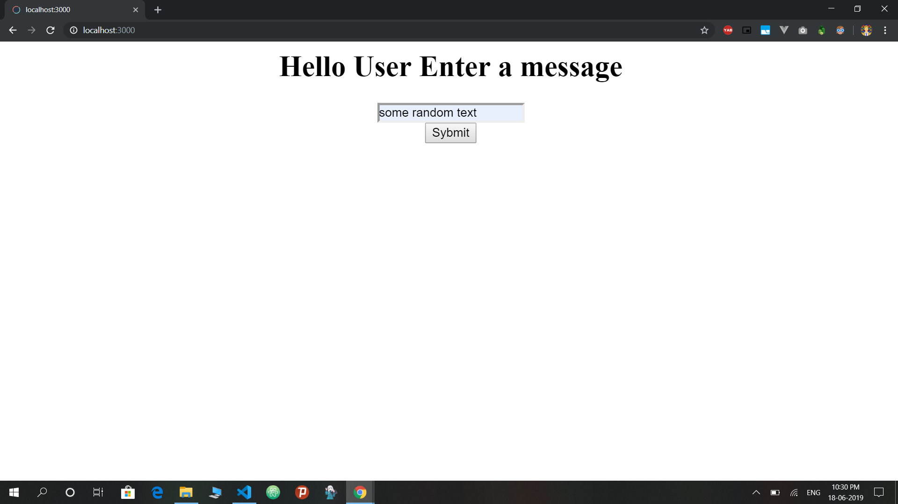

<h1 align="center">Taking input from webpage to file</h1>

Created a server using Node and taking input and storing in `message.txt`

## How to test the app
- Clone this repository to your local machine
- Install dependencies `npm install`
- Start the application `npm start` The magic happens on port `3000`

